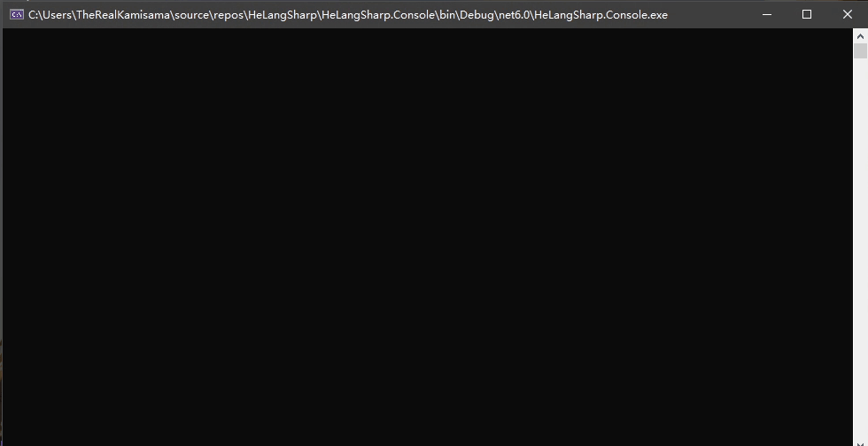

# HeLangSharp
Next-Generation Cyber Programming Language from Li Tang, with .NET support.

[演示视频](https://www.bilibili.com/video/BV1Px411w7FH)

灵感：[HeLangKotlinScriptImpl](https://github.com/shaokeyibb/HeLangKotlinScriptImpl)

## 介绍

作为一名资深的大陆西方网友，HeLangSharp 跨时代的采用了 .NET 6 作为基础，绝对不是什么 PPT 产品，也绝对不是基于什么 C井 10 实现的，完全实现了自主知识产权，并且引入了汉语编程，打破了东方人的技术垄断😅。

## 愿景

新时代来临，我们的HeLangSharp实现了历史性跨越式发展，形势得到切实巩固和提高，作用得到深刻变化；差距发展步伐加快；规律又快又好发展。目前我们已坚持传统，通达政策，帮助管理，了解矛盾。但是我们也要清醒地认识到，格局的发展仍不能满足广大人民群众对于HeLangSharp的强烈需求，还不能适应构建和谐社会的迫切需要。HeLangSharp发展不平衡的问题突出，实施速度尚未取得根本性突破，总体布局改革需要深化，结合点需要提高，基层尚未得到很好解决。

> ~~绝对不是用申论生成器写的~~

## 使用方法

1. 拉取源代码

```shell
> git clone https://github.com/Cyl18/HeLangSharp.git
```

2. 新建一个项目，并在 Visual Studio 中引用项目

3. 在代码中加上一行

```csharp
using static HeLangSharp.U8CentralFiniteCurve;
```

## 语法

基本语法参见 [kifuan/helang](https://github.com/kifuan/helang)

但是但是！由于爱与和平的关系，一些语法在 .NET 平行宇宙中不能其以原始形态呈现😭😭😭。

### 基础语法

曾经有一位圣人说过 **万物始于典，终于乐**(~~绝对不是某个群友说的~~)。  
于是要创建一个 `u8`，你需要在它的开头加上`典`，在它的结尾使用`乐`

```csharp
u8 b = dian | 1 | 2 | 3 | 4 | 5 | le;
```

为了实现中文编程，我们同样支持：

```csharp
u8 a = 典 | 1 | 2 | 3 | 4 | 5 | 乐;
```

### 自增运算

在这里，我们的 u8 是可变的：

```csharp
u8 a = 典 | 1 | 2 | 3 | 4 | 5 | 乐;
a++;
Print(a); // 2 | 3 | 4 | 5 | 6
```

### 其它语法

经过 **量子虫洞技术™** 🥵 的加持，以 u8 作为下标也是支持的：

```csharp
u8 a = dian | 1 | 2 | 3 | 4 | 5 | le;
a[dian | 1 | 3 | le] = 0;

```

### 高性能

新期待，新时代，新使命，新方位，新水平;
新境界，新举措，新发展，新突破，新成绩;
新成效，新方法，新成果，新形势，新要求;

我们创新性的支持了最新的 `stackalloc` 语法来让 u8 的性能达到新高度🤣。

```csharp
u8 a = stackalloc nint[10];
a[0] = 1; // 1 | 1 | 1 | 1 | 1 | 1 | 1 | 1 | 1 | 1
```

### 5G 测速

> 由于Console.WriteLine()的的速度限制, 以及windows下15.7ms的最大时间分辨率  
> 我实际上体验到的还是4G的速度, 听到这个我心凉了半截😥  
```csharp
Test5G();
``` 


## 单元测试

惊人的 100%™ 单元测试覆盖率🤩。你也可以在[这里](https://github.com/Cyl18/HeLangSharp/blob/master/HeLangSharp.Tests/UnitTest1.cs)查看测试样例。

## Credits

- Cyl18 项目发起
- TheRealKamisama 5G支持 文档修改

## 开源协议

[Anti 996 License Version 1.0](https://github.com/kattgu7/Anti-996-License)
